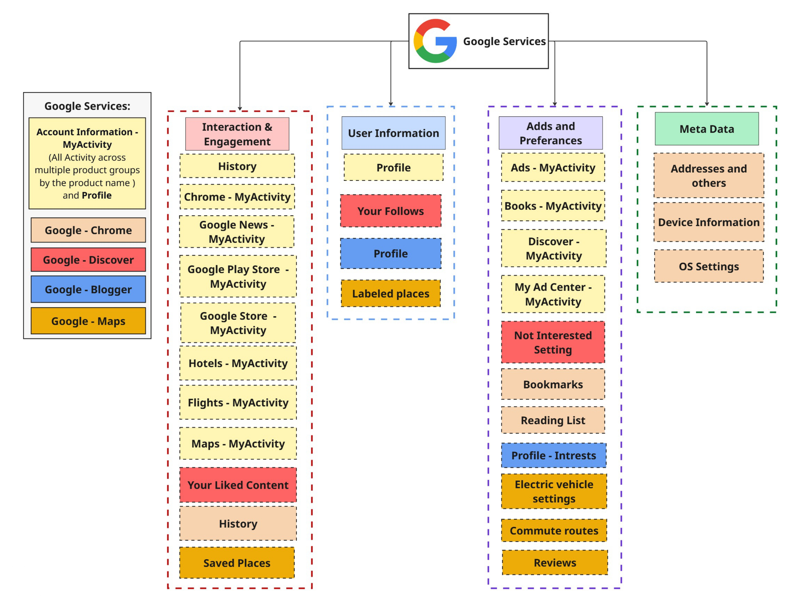

# Google Services 

Google Services are a collection of online tools and applications provided by Google to help users with communication, productivity, entertainment, and information. These services include Gmail for email, Google Drive for cloud storage, Google Maps for navigation, Google Photos for storing and organizing images, Google Calendar for scheduling, and Google Docs, Sheets, and Slides for creating and collaborating on documents. Other services include YouTube for video content, Google Search for finding information, and Google Translate for language translation. 

Google offers a service called Google Takeout, which allows users to download a copy of the data associated with their Google Account. This includes information from a wide range of Google’s core and related services such as Gmail, Google Drive, Google Photos, YouTube, Maps, Calendar, Contacts, Chrome, Blogger, and many others.

Currently, Google Takeout supports exporting data from more than 69 different Google services. Users can choose to download all available data or select only the services that interest them. The exported files may vary in format (e.g., JSON, CSV, MBOX, or HTML), depending on the type of service.

## Summary of data available through Google Takeout service.

<table class="c16"><tr class="c6"><td class="c9 c10" colspan="1" rowspan="1">
Data source (Google services)
</td><td class="c1 c10" colspan="1" rowspan="1">
Description
</td><td class="c4 c10" colspan="1" rowspan="1">
Formats
</td></tr><tr class="c15"><td class="c9" colspan="1" rowspan="1">
Log Activity 
</td><td class="c1" colspan="1" rowspan="1">
Activities - A list of Google services accessed by your devices (for example every time your phone synchronizes with your Gmail)

Devices - A list of devices (i.e. Nest, Pixel, iPhone, Galaxy, etc) which have accessed your Google account over the last 30 days
</td><td class="c4" colspan="1" rowspan="1">
CSV
</td></tr><tr class="c6"><td class="c9" colspan="1" rowspan="1">
Blogger
</td><td class="c1" colspan="1" rowspan="1">
Your Blogger blogs, including posts, pages, comments and videos, as well as settings and your Blogger profile.
</td><td class="c4" colspan="1" rowspan="1">
Atom syndication format

JSON

CSV
</td></tr><tr class="c6"><td class="c9" colspan="1" rowspan="1">
Chrome
</td><td class="c1" colspan="1" rowspan="1">
Bookmarks, history, and other settings from Chrome
</td><td class="c4" colspan="1" rowspan="1">
JSON

HTML

CSV
</td></tr><tr class="c6"><td class="c9" colspan="1" rowspan="1">
Discover
</td><td class="c1" colspan="1" rowspan="1">
Your follows, likes, and not interested settings that are saved by Discover.
</td><td class="c4" colspan="1" rowspan="1">
JSON 

CSV
</td></tr><tr class="c6"><td class="c9" colspan="1" rowspan="1">
Maps
</td><td class="c1" colspan="1" rowspan="1">
Your preferences and personal places in Maps
</td><td class="c4" colspan="1" rowspan="1">
JSON 

CSV
</td></tr><tr class="c6"><td class="c9" colspan="1" rowspan="1">
Maps (your places)
</td><td class="c1" colspan="1" rowspan="1">
Records of your starred places and place reviews
</td><td class="c4" colspan="1" rowspan="1">
GEOJSON
</td></tr><tr class="c14"><td class="c9" colspan="1" rowspan="1">
My Activity
</td><td class="c1" colspan="1" rowspan="1">
Includes your web searches, YouTube views, Maps queries, etc.
</td><td class="c4" colspan="1" rowspan="1">
HTML

CSV
</td></tr><tr class="c14"><td class="c9" colspan="1" rowspan="1">
Profile
</td><td class="c1" colspan="1" rowspan="1">
Settings and images from your Google profile
</td><td class="c4" colspan="1" rowspan="1">
JSON

HTML
</td></tr><tr class="c14"><td class="c9" colspan="1" rowspan="1">
YouTube and YouTube Music
</td><td class="c1" colspan="1" rowspan="1">
Watch and search history, videos, comments and other content you&#39;ve created on YouTube and YouTube Music.
</td><td class="c4" colspan="1" rowspan="1">
CSV
</td></tr></table>

The main categories of Google data are summarised below

